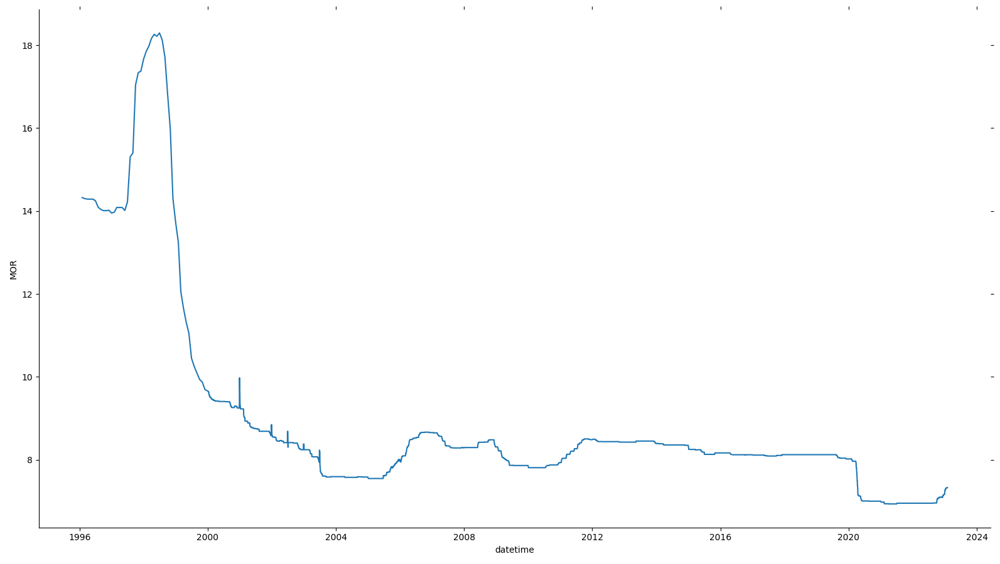
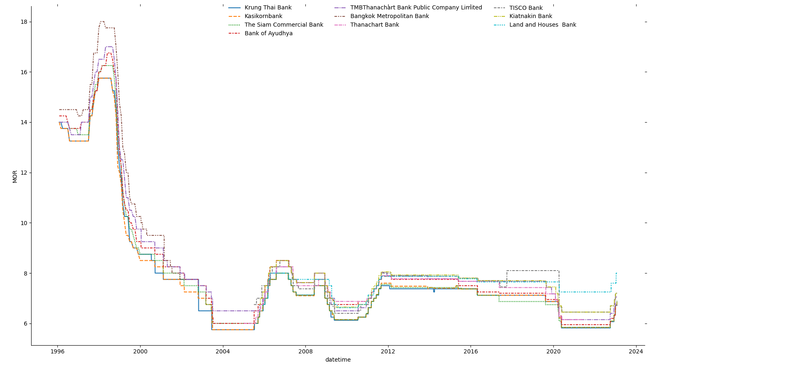
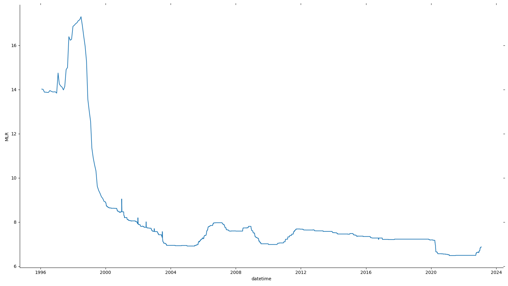
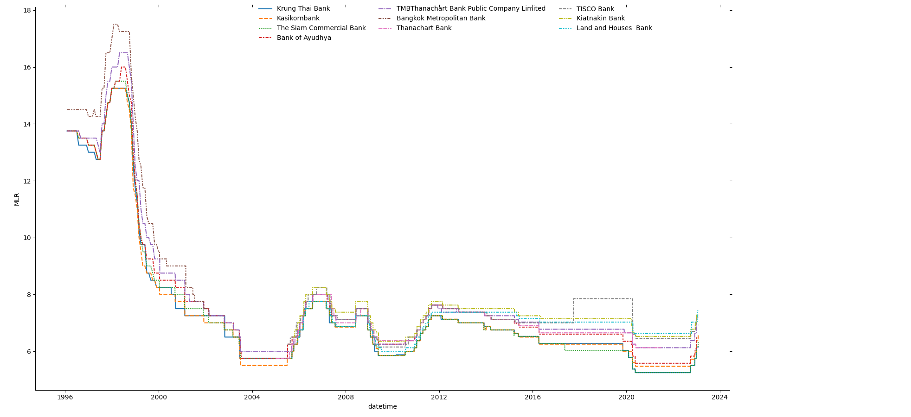

# Python code to scrap historical interest rates data of each banks from bot.or.th

This is a jupyter notebook to extract historical interest rates of each commercial banks in Thailand since 31JAN1996 (31 ม.ค. 2539)

The [BOT webpage](https://www.bot.or.th/thai/statistics/_layouts/application/interest_rate/in_historical.aspx) provide historical interest rates per day of selected bank and given date range either in XLS format or CSV format. However, the date range is limited to 1 year and a single bank can be selected at a time.

## Objective
- To automate data extraction from this webpage in order to extract all different commercial banks in Thailand and data from 31JAN1996 into a consolidated format.
- Expected formats : CSV, JSON, SQL.

## Assessment
// Done on 13JAN2023

From the webpage, the download buttons are using Javascript as following:

```
<a href="#" onclick="downloadFile('interestXLS')" class="app_table_content_link">...</a>
<a href="#" onclick="downloadFile('interestCSV')" class="app_table_content_link">...</a>
```

And this ```downloadFile``` function works as following

1. Retrieve inputs such as dateFrom, dateTo, bankId, bankName and an option to select whether to extract interest rate for deposit or loan
2. Construct an url link with above params, the url is https://www.bot.or.th/thai/statistics/_layouts/application/interest_rate/DownloadFile.aspx
4. Open a tab to the url to start download a file corresponding to the inputs.

```
function downloadFile( dlType){
  var dateFrom = document.getElementById("ctl00_PlaceHolderMain_hdFDate").value;
  var dateTo = document.getElementById("ctl00_PlaceHolderMain_hdTDate").value;
  var ddlBank = document.getElementById("ctl00_PlaceHolderMain_ddlBank"); //option object
  var bankId = ddlBank.options[ddlBank.options.selectedIndex].value;
  var bankName = ddlBank.options[ddlBank.options.selectedIndex].text;
  var rdoDeposit = document.getElementById("ctl00_PlaceHolderMain_rdoType_0");
  var rdoType;
  if(rdoDeposit.checked){
      rdoType = 0;
  }else{
      rdoType = 1;
  }
var url = "./DownloadFile.aspx?dlType=" + dlType + "&dateFrom=" + dateFrom + "&dateTo=" + dateTo + "&bankValue=" + bankId + "&bankName=" + bankName + "&rdoTypeStr=" + rdoType;
//alert(url);
  window.location.href = url;
}
```

The list of all available banks are in the ```select``` input as following:

```
<select name="ctl00$PlaceHolderMain$ddlBank" id="ctl00_PlaceHolderMain_ddlBank" class="bot-form-field">
	<option value="0">เลือกธนาคาร...</option>
	<option value="002">กรุงเทพ</option>
	<option value="006">กรุงไทย</option>
	<option value="004">กสิกรไทย</option>
	<option value="014">ไทยพาณิชย์</option>
	<option value="025">กรุงศรีอยุธยา</option>
	<option value="011">ทหารไทย</option>
	<option value="011">ทหารไทยธนชาต</option>
	<option value="015">นครหลวงไทย</option>
	<option value="021">ศรีนคร</option>
	<option value="024">ยูไนเต็ด โอเวอร์ซีส์ (ไทย)</option>
	<option value="024">ยูโอบี</option>
	<option value="024">เอเชีย</option>
	<option value="022">ซีไอเอ็มบี ไทย</option>
	<option value="012">ดีบีเอส ไทยทนุ</option>
	<option value="020">สแตนดาร์ดชาร์เตอร์ด (ไทย)</option>
	<option value="020">สแตนดาร์ดชาร์เตอร์ดนครธน</option>
	<option value="019">ยูโอบี รัตนสิน</option>
	<option value="010">แห่งโตเกียว-มิตซูบิชิ</option>
	<option value="010">แห่งโตเกียว-มิตซูบิชิ ยูเอฟเจ</option>
	<option value="017">ซิตี้แบงก์</option>
	<option value="018">ซากุระ</option>
	<option value="018">ซูมิโตโม มิตซุย แบงกิ้ง คอร์ปอร์เรชั่น</option>
	<option value="031">เอช เอส บี ซี</option>
	<option value="031">ฮ่องกงและเซี่ยงไฮ้แบงกิ้งคอร์ปอเรชั่น</option>
	<option value="032">ดอยซ์แบงก์</option>
	<option value="007">สแตนดาร์ดชาร์เตอร์ด</option>
	<option value="008">เจพีมอร์แกน เชส</option>
	<option value="008">เชสแมนแฮตตัน</option>
	<option value="028">คาลิยง</option>
	<option value="028">เครดิต อะกริกอล คอร์ปอเรทแอนด์อินเวสเมนท์แบงก์ </option>
	<option value="028">เครดิต อะกริกอล อินโดสุเอซ</option>
	<option value="027">แห่งอเมริกาเนชั่นแนลแอสโซซิเอชั่น</option>
	<option value="029">ภารตโอเวอร์ซีส์</option>
	<option value="029">อินเดียนโอเวอร์ซีส์</option>
	<option value="005">เดอะรอยัลแบงก์อ๊อฟสกอตแลนด์ พีแอลซี </option>
	<option value="005">เดอะรอยัลแบงก์อ๊อฟสกอตแลนด์ เอ็น.วี.</option>
	<option value="005">เอบีเอ็น แอมโร เอ็น.วี.</option>
	<option value="026">สากลพาณิชย์แห่งประเทศจีน</option>
	<option value="023">อาร์ เอช บี</option>
	<option value="009">โอเวอร์ซี-ไชนิสแบงกิ้งคอร์ปอเรชั่น</option>
	<option value="047">เพื่อการอุตสาหกรรมแห่งประเทศญี่ปุ่น</option>
	<option value="046">ซูมิโตโม</option>
	<option value="052">แห่งประเทศจีน</option>
	<option value="039">ได-อิจิ คังเงียว</option>
	<option value="039">มิซูโฮ</option>
	<option value="039">มิซูโฮ คอร์ปอเรต</option>
	<option value="040">เดรสต์เนอร์ เอจี</option>
	<option value="053">แห่งโนวาสโกเทีย</option>
	<option value="045">บีเอ็นพี พารีบาส์</option>
	<option value="065">ธนชาต</option>
	<option value="003">กรุงเทพฯ พาณิชยการ</option>
	<option value="067">ทิสโก้</option>
	<option value="013">มหานคร</option>
	<option value="026">เมกะ สากลพาณิชย์</option>
	<option value="026">สากลพาณิชย์แห่งประเทศจีน</option>
	<option value="041">โซซิเยเต้ เจเนราล</option>
	<option value="048">ยูเอฟเจ</option>
	<option value="069">เกียรตินาคิน</option>
	<option value="069">เกียรตินาคินภัทร</option>
	<option value="073">แลนด์ แอนด์ เฮ้าส์ </option>
	<option value="073">แลนด์ แอนด์ เฮ้าส์ เพื่อรายย่อย</option>
	<option value="070">สินเอเซีย</option>
	<option value="070">ไอซีบีซี (ไทย)</option>
	<option value="072">จีอี มันนี่ เพื่อรายย่อย</option>
	<option value="071">ไทยเครดิตเพื่อรายย่อย</option>
	<option value="068">เอไอจี เพื่อรายย่อย</option>
	<option value="052">แห่งประเทศจีน(ไทย)</option>
	<option value="079">ธนาคารเอเอ็นแซด (ไทย) จำกัด (มหาชน)</option>
	<option value="080">ซูมิโตโม มิตซุย ทรัสต์  (ไทย)</option>
</select>
```

The download url doesn't require any authentication so it is feasible to directly access to it and modify the params within its capacity allowed to extract the data.

## Result

### MOR interest rate





### MLR interest rate





## Setup

### Create virtual environment

```
virtualenv venv
```

### Activate virtual environment

For Windows,

```
. .\venv\Scripts\activate
```

### Install dependencies

```
pip install -r requirements.txt
```

### Run Jupyter Notebook

```
jupyter notebook
```

Then open a browser to http://localhost:8888 or http://127.0.0.1:8888

## TODO

- [X] To loop each year starting from 1996 to current year
- [X] By default for each year, dateFrom is 01JAN{year} and dateTo is 31DEC{year}
- [X] Only for year 1996, dateFrom is 31JAN1996
- [X] Only for current year, dateTo is ```today```
- [X] To loop each commercial banks available
- [X] For each loop, turn CSV response into a dataframe
- [X] For each loop, Add a column in the dataframe for bank name/id
- [ ] (Potentially) Convert Thai date format (i.e. 03 ม.ค. 2566) into international/ISO 8601 date format ```YYYY-MM-DD``` (i.e. 2023-01-03)
- [X] Consolidate all dataframe into a single dataframe
- [X] pip install progressbar
- [X] Use progressbar to display progress of data extraction

